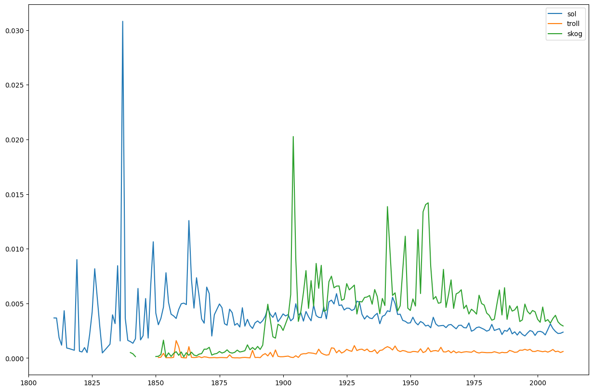
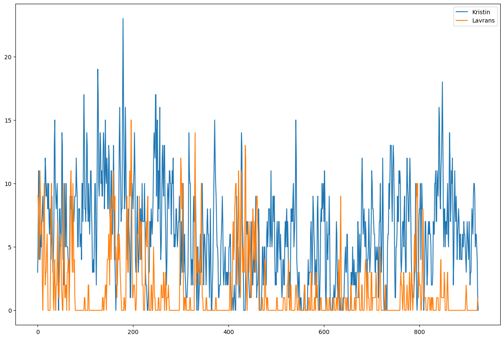

# Examples of use

The python package calls the [DHLAB API](https://api.nb.no/dhlab/) to retrieve and present data from the digital texts.

Analyses can be performed on both a single document, and on a larger corpus. 

<!-- start example-use -->

Here are some of the text mining and automatic analyses you can do with `dhlab`:


## Build a corpus

Build a [corpus](#dhlab.Corpus) from bibliographic metadata about publications, e.g. books published between 1980 and 1905: 

```{code-block} python
import dhlab as dh

book_corpus = dh.Corpus(doctype="digibok", from_year=1980, to_year=2005)
```

## Word frequencies

Retrieve word (token) [frequencies](#dhlab.Corpus.count) from a corpus:

```{code-block} python
# Frequencies of each word (rows) per book, referenced by their unique ID (columns) 
book_corpus.count()
```

## Bags of words

Fetch [chunks of text](#dhlab.Chunks) (paragraphs) as bag of words from a specific publication:

```{code-block} python

docid = "URN:NBN:no-nb_digibok_2007091701028"
c = dh.Chunks(urn=docid, chunks="para")
c.chunks[0]  # The first bag-of-words is the title
# {'TROLLBYEN': 1}

c.chunks[1] # Second bag-of-words is a paragraph, with word counts
```

## Concordance

Extract [concordances](#dhlab.Concordance) from the corpus: 

```{code-block} python
c = book_corpus.conc(words="troll")

c.concordance  
# Output is a pandas Dataframe, 
# including links to the concordance's positions in books on nb.no
```

## Collocations
Compute [collocations](#dhlab.Collocations), a ranking of relevant words to a given word:

```{code-block} python
c = book_corpus.coll(words="sol")
c.coll.head(10) # The top 10 most relevant words to "sol" in our corpus
#                 counts
#,                     1
#.                     2
#Ei                    1
#Lite                  1
#Norge                 1
#antydninger           1
#det                   1
#enkelte               1
#etterkrigstiden       1
#gi                    2
```

## N-grams
Retrieve [n-gram](#dhlab.ngram.nb_ngram) frequencies per yer in a time period. 

```{code-block} python
n = dh.ngram.nb_ngram.nb_ngram("sol,troll,skog")
n.plot()
```
The `plot` method gives us this graph: 


Check out our [N-gram app](https://www.nb.no/ngram/#1_1_1__1_1_3_1810%2C2022_2_2_2_12_2) for an online visual graph of all uni-, bi-, and trigrams in the National Library's digitized collection of publications.

## Named Entity Recognition

Extract occurrences of [named entities](#dhlab.NER), for example place names:

```{code-block} python
docid = 'URN:NBN:no-nb_digibok_2007091701028'
ner = dh.api.dhlab_api.get_places(docid)
```

## Word dispersions

Plot narrative graphs of word [dispersions](#dhlab.text.dispersion.Dispersion) in a publication, for instance in "Kristin Lavransdatter":

```{code-block} python
from dhlab.text.dispersion import Dispersion

docid = "URN:NBN:no-nb_digibok_2018021248144"
d = Dispersion(docid, wordbag=["Kristin","Lavrans"], window=1000, pr=500)
d.plot()
```
`Dispersion.plot()` gives us this diagram:


<!-- end example-use -->
